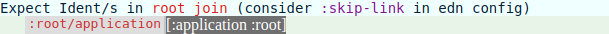
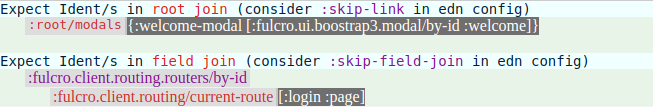
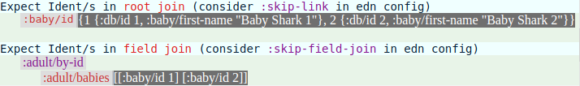
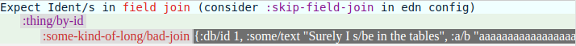
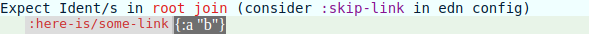

# default-db-format

Checks that your Fulcro client state is formatted as per the normalized storage format - aka **Default DB Format**

#### Current release:

[](https://clojars.org/default-db-format)

**default-db-format** is a development tool that checks client state stays normalized in the face of your code's mutations. It does this with an understanding of the conventions that the keys of the state map use. So for instance if a `by-id` field value such as `(get-in [my-table-name/by-id 14] :my/join)` becomes something other than: 

 * an Ident or 
 * vector of Idents or 
 * a simple *scalar* value, 
 
then this will be recognised and a heads-up display (HUD) will pop up. Note that simple *scalar* value is defined to include objects such as dates and uuids.

This library is a Fulcro tool. As such the setup will be similar to that for [Fulcro Inspect](https://github.com/fulcrologic/fulcro-inspect), which you have likely already installed. In your Leiningen project file make sure that `[default-db-format "0.1.1-SNAPSHOT"]` is an entry in your `:dev` profile's `:dependencies` vector. Then look for `:preloads` and `:external-config` in the `"dev"` `:cljsbuild`:

````clojure
:preloads         [devtools.preload
                   default-db-format.preload
                   fulcro.inspect.preload]
:external-config  {:fulcro.inspect/config {:launch-keystroke "ctrl-f"}
                   :default-db-format/config {:collapse-keystroke "ctrl-q"
                                              :debounce-timeout   2000}}
```` 

The *collapse keystroke* is a toggle to get this tool out of the way of the UI of the host application you are working on. The *debounce timeout* ensures that when your application's state is being hammered with changes *Default DB Format* will only be checking it every so often. Note that `default-db-format.preload` should come before `fulcro.inspect.preload` (*).

The default configuration for `default-db-format.core/check` is: 
````clojure
{:by-id-ending #{"/by-id" "/BY-ID"}}
````
However it is likely you will need to set your own configuration, perhaps choosing a different set of strings for `:by-id-ending`. Configuration is done in the `default-db-format.edn` file, kept at `/resources/config/`. See the [Reference](#edn-configuration-reference) for the meanings of all the configuration keys.

#### Fulcro Websocket Demo

You should see this message pop up in the browser:


The *Default DB Format* tool has examined the state map and not found any tables. If you inspect the state then this map-entry should catch your eye:

````clojure
:LOGIN-FORM-UI {:UI {:db/id :UI, :ui/username ""}}
````
Here `:LOGIN-FORM-UI` is obviously a table/component/class with only one instance possible, signified by the second (or *id*) part of the Ident being `:UI` rather than some number. Thus we have probably discovered the convention for 'one of' components in this project. Armed with this insight we can now create our `default-db-format.edn` file:

````clojure
{:one-of-id :UI}
````
Changes to this file will only be picked up when you `(reload-config)` in Figwheel and Shift-F5 in the browser to directly reload the page.

On browser reload a message from the console shows the new configuration has indeed been picked up. This time the HUD may briefly flash up, but when all state changes are complete there will be nothing for *Default DB Format* to complain about.

#### Fulcro ToDoMVC

You should see this message pop up in the browser:



The state has a map-entry: `:root/application [:application :root]`, and one of the components has an Ident: `[:application :root]`. The tool is (correctly) telling us it thinks that `:root/application` is a join, and as such its value should either be an Ident or a vector of Idents. So the tool is not picking up that `[:application :root]` is an Ident. If `:application` had instead been `:application/by-id` the tool would have been happy. So we need to tell the tool that `:application` is a table, even though it doesn't satisfy `:by-id-ending`:

````clojure
{:not-by-id-table :application}
````

Note that for all config keys where it is sensible you can provide their values however you like. For instance here the value `:application` will be translated internally into `#{:application}`. Both `[:application]` and `#{:application}` would have been acceptable alternatives to `:application` for `:not-by-id-table`.

#### Fulcro Template



Starting with the second complaint, there's a special key for routing table names: `:routing-table`. It doesn't take too much investigation of the state or code to find the possible values apart from `:login`. 

The first complaint is about `:root/modals`. It cannot be a root level join because its value is a map (rather than an Ident or a vector of Idents). It cannot be a table because the value associated with `:welcome-modal` key is not a map. So `:root/modals` must be a link. It is interesting to compare it with the map-entry in the state for `:current-user`, which is a root level join:

````clojure
:current-user [:user/by-id 2]
````
If you compare `:root/modals` and `:current-user` in the code you can see that they both look like joins in the `Root` component, but `:root/modals` points to a component (`Modals`) that does not have an Ident. An alternative implementation would give `Modals` an Ident and it would become a 'one of' table/component. Anyway `:root/modals` is a link and this is our edn:

````clojure
{:routing-table [:login :main :new-user :preferences]
 :link          [:root/modals]}
```` 

#### Baby Sharks (*Default DB Format* devcard)



From the second complaint we can see that the table `:adult/by-id` has a join `:adult/babies` that the tool thinks ought to be a vector of Idents. Of course we can tell that they are Idents, just without the usual `/by-id`. In the first complaint the tool has incorrectly assumed that a root/top level join called `:baby/id` has the problem that its value is not a vector of Idents. Of course its premise is incorrect - `:baby/id` is not a join but a table. Here's a clearer view of what the table looks like in state:

````clojure
:baby/id
 {1 {:db/id 1
     :baby/first-name "Baby Shark 1"}
  2 {:db/id 2
     :baby/first-name "Baby Shark 2"}}
````
If we can get the tool to understand that `:baby/id` is the name of a table both complaints ought to resolve:

````clojure
{:by-id-ending #{"/by-id" "/BY-ID" "/id"}}
````
Notice that we have chosen to keep the default convention: if we had made the value merely `#{"/id"}` then `:by-id-ending` would become a misnomer!

The Baby Sharks devcard consists of a series of buttons that intentionally affect the state in order to bring up *Default DB Format* messages. The first button is "Give a field-join a map". This is almost always a real problem that needs to be fixed. So this time there won't be a configuration change. We've seen this one before, but not where the value is a map:



If for some reason you did want to have maps as *scalar* value objects then `:acceptable-map-value` can be used to specify them. So for example setting it to `[:r :g :b]` would allow `{:g 255 :r 255 :b 255}`. Vectors are also supported as value objects with `:acceptable-vector-value`.

If your objects are not simple enough to describe using `:acceptable-map-value` or `:acceptable-vector-value`, or the situation is more that a particular join is designated as a denormalized object holder, then `:skip-field-join` (or `:skip-link` if the join is at the root level) can come to the rescue.

There's a button that will restore the state, after which you should press "Give a root-join a map":



It is quite common to keep maps (or any other denormalized data) in links, which in a normal application we would do by setting the key `:skip-link` to `:here-is/some-link` in the config file and then doing `(reload-config)` in Figwheel and Shift-F5 in the browser. Here we can just make use of the "Restore order..." button. In reality this where *Default DB Format* is earning its keep - it is telling you about a problem your mutations have inadvertently caused.

#### Fulcro Inspect

````clojure
{:one-of-id       ["main" :singleton]
 :by-id-ending    ["id"]
 :not-by-id-table [:fulcro.inspect.ui.dom-history-viewer/dom-viewer
                   :fulcro.inspect.ui.multi-inspector/multi-inspector
                   :fulcro.inspect.ui.data-history/history-id
                   :fulcro.inspect.ui.element/panel-id
                   :fulcro.inspect.ui.network/history-id
                   :fulcro.inspect.ui.transactions/tx-list-id
                   :fulcro.inspect.ui.network/request-id
                   :fulcro.inspect.ui.transactions/tx-id]
 :skip-link       [:fulcro.inspect.ui.element/panel-id
                   :fulcro.inspect.ui.network/request-id
                   :fulcro.inspect.ui.transactions/tx-id
                   :fulcro.inspect.ui.network/remotes
                   :fulcro.inspect.ui.network/request-edn
                   :ui/root
                   ]
 :skip-field-join [:fulcro.inspect.ui.transactions/tx-list-id
                   :fulcro.inspect.ui.network/history-id
                   :fulcro.inspect.ui.network/remotes
                   :fulcro.inspect.ui.element/panel-id
                   :fulcro.inspect.ui.network/request-edn-row-view
                   :fulcro.inspect.ui.network/request-edn
                   :fulcro.inspect.ui.network/response-edn
                   :fulcro.inspect.ui.network/error
                   :fulcro.inspect.ui.data-history/history
                   :fulcro.inspect.ui.data-history/history-id
                   :fulcro.inspect.ui.data-viewer/content
                   :fulcro.inspect.ui.data-viewer/expanded
                   :app-state
                   :old-state
                   :new-state
                   :tx
                   :ret
                   :fulcro.history/tx
                   :fulcro.history/db-after
                   :fulcro.history/db-before
                   :fulcro.history/network-sends
                   ]
 }
````

*Fulcro Inspect* is normally ignored by *Default DB Format*. However it, or any other client app can be targeted using the lein `:default-db-format/config` key `:host-root-path`. Here it was set to "fulcro.inspect.core/GlobalRoot". Messages in the browser console inform you of the names of (non-tool) apps that are discarded, in case *Default DB Format* has targeted the wrong one when you are developing a multiple app client.

#### Fulcro

Fulcro causes some de-normalization to your app's state, which is internalized by *Default DB Format*. If it were not, this is what the edn configuration delta would need to be:

````clojure
{:skip-field-join :fulcro.ui.forms/form
 :skip-link [:fulcro/server-error :fulcro.client.routing/routing-tree]}
````

#### Development

There is only one cljs build in `project.clj` and one HTML file in `resources/public`: `cards.html`. As this project is 'client side only' create what IntelliJ calls a "Run/Debug Configuration" that has "Parameters" set to `script/figwheel.clj`. Once Figwheel is going use the browser to navigate to `http://localhost:3449/cards.html`.

There are some tests that can be run using `lein run` from the command line. Or create a Server REPL to call them directly. At the REPL `(refresh)` (from `dev/user.clj`) will get you started. `clojure.test` can be used because the underlying logic (`default-db-format.core/check`) is in .cljc files.

The workflow I used to manually test this tool against other applications was to `lein clean` `lein install` from *Default DB Format*, then `lein clean` `lein deps` from the target application where *Default DB Format* has already been set up as a tool. Testing against devcards is great in comparison because all can be handled by Figwheel. Often all you need to do is make a change and press F5 to reload. Of course you will still have to `(reload-config)` upon changing the edn file, but you will never have to execute the lein commands.

#### Internal version

The current internal version is **30**. Having an internal version makes sense for when dealing with snapshots. 30 (and all prior numbers) go with "0.1.1-SNAPSHOT". 30 is displayed by the HUD.

#### Edn Configuration Reference

Key | Explanation
------------ | -------------
`:by-id-ending` | What comes at the end of an Ident's class (first position). Must be a string. By default is `#{"/by-id" "/BY-ID"}`. Note that the slash is often provided in the string you supply, but doesn't have to be, so that for example "id" will promiscuously match on both `:my-table-ends-with-id` and `:my-table/id`.
`:one-of-id` | Something standard in the Ident's second position, for components that the application only needs one of. For example `:UI`.
`:not-by-id-table` | Some table names do not follow a `"/by-id"` convention.
`:routing-table` | Any table used as the class (first position) of a routing Ident. Treated internally the same as `:not-by-id-table`.
`:skip-link` | A root level key that you don't want to be inspected. Often you might have a map at the top level that is not going to pass as root join. It is a link and you specify it as such here. Note that join keys that are not namespaced or just contain simple scalar values are ignored anyway.
`:skip-field-join` | A field level join key that you don't want to be part of normalization. Same concept as `:skip-link`, but in the field of an entity rather than at the root level.
`:acceptable-map-value` | Description using a vector where it is a real leaf thing (simple *scalar* value), e.g. `[:r :g :b]` for colour will mean that `{:g 255 :r 255 :b 255}` is accepted.
`:acceptable-vector-value` | Allowed objects in a vector, e.g. `[:report-1 :report-2]` for a list of reports will mean that `[:report-1]` is accepted but `[:report-1 :report-3]` is not. Note that the order of the objects is not important.

#### License

Copyright © 2018 Chris Murphy

Distributed under the MIT license.

**(*)** The reason it is better *Default DB Format* come before *Fulcro Inspect* is explained by comments in the source code above the def `default-db-format.tool/ignore-fulcro-inspect`.
