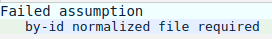
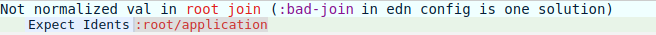
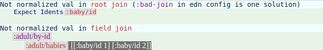
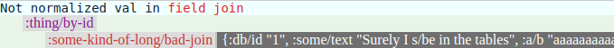
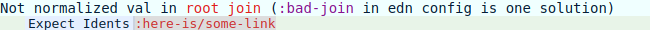

# default-db-format

Checks that your Fulcro client state is formatted as per the normalized storage format - a.k.a.: **default db format**

#### Current release:

[](https://clojars.org/default-db-format)

#### Description

**default-db-format** is a development tool that checks client state stays normalized in the face of your code's mutations. It does this with an understanding of the conventions that the keys of the state map use. So for instance if a `by-id` field value such as `(get-in [my-table-name/by-id 14] :my/join)` becomes a map rather than an Ident or vector of Idents, then this will be recognised and a heads-up display (HUD) will pop up.

This library is a Fulcro tool. As such the setup will be similar to that for [Fulcro Inpect](https://github.com/fulcrologic/fulcro-inspect), which you have likely already installed. In your Leiningen project file make sure that `[default-db-format "0.1.1-SNAPSHOT"]` is an entry in your `:dev` profile's `:dependencies` vector. Then look for `:preloads` and `:external-config` in the "dev" :cljsbuild:

````clojure
:preloads         [devtools.preload
                   fulcro.inspect.preload
                   default-db-format.preload]
:external-config  {:fulcro.inspect/config {:launch-keystroke "ctrl-f"}
                   :default-db-format/config {:collapse-keystroke "ctrl-q"
                                              :debounce-timeout   2000}}
```` 

The collapse keystroke is a toggle to get this tool out of the way of the application UI you are working on. The debounce timeout ensures that when your application's state is being hammered with changes default-db-format will only be checking it every so often.

#### Configuration

Here we cover the configuration options for `default-db-format.core/check` using some example applications. The default configuration is: 
````clojure
{:by-id-kw #{"by-id" "BY-ID"}}
````
However it is likely you will need to set your own configuration, which is done in the `default-db-format.edn` file, kept at `/resources/config/`. 

##### Fulcro Websocket Demo

You should see this message pop up in the browser:



The default-db-format tool has examined the state map and not found any tables. If you inspect the state then this map-entry should catch your eye:

````clojure
:LOGIN-FORM-UI {:UI {:db/id :UI, :ui/username ""}}
````
Here `:LOGIN-FORM-UI` is obviously a table/component/class with only one instance possible, signified by the second (or *id*) part of the Ident being `:UI` rather than some number. Thus we have probably discovered the convention for 'one of' components in this project. Armed with this insight we can now create our `default-db-format.edn` file:

````clojure
{:one-of-id :UI}
````
Changes to this file will only be picked up when you `(reload-config)` in Figwheel and Shift-F5 in the browser to directly reload the page.

On browser reload a message from the console shows the new configuration has indeed been picked up. This time the HUD may briefly flash up, but when all state changes are complete there will be nothing for default-db-format to complain about. 

##### Fulcro ToDoMVC

You should see this message pop up in the browser:



The state has a map-entry: `:root/application [:application :root]`, and one of the components has an Ident: `[:application :root]`. The tool is (correctly) telling us it thinks that `:root/application` is a join, and as such its value should either be an Ident or a vector of Idents. So the tool is not picking up that `[:application :root]` is an Ident. If `:application` had instead been `:application/by-id` the tool would have been happy. So we need to tell the tool that `:application` is a table, even though it doesn't end with `/by-id`:

````clojure
{:not-by-id-table :application}
````

Note that for all config values where it is sensible you can provide the value however you like. For instance here `:application` will be translated internally into `#{:application}`. Both `[:application]` and `#{:application}` would have been acceptable alternatives to `:application`.

##### Baby Sharks (a default-db-format devcard)



From the second message we can see that the table `:adult/by-id` has a join `:adult/babies` that the tool thinks ought to be a vector of Idents. Of course we can tell that they are Idents, just without the usual `/by-id`. In the first message the tool has incorrectly assumed that a root/top level join (a link) called `:baby/id` has the problem that its value is not a vector of Idents. Of course its premise is incorrect - `:baby/id` is actually a table. Here's what the table looks like in state:

````clojure
:baby/id
 {1 {:db/id 1
     :baby/first-name "Baby Shark 1"}
  2 {:db/id 2
     :baby/first-name "Baby Shark 2"}}
````
If we can get the tool to understand that `:baby/id` is the name of a table both messages ought to clear:

````clojure
{:by-id-kw #{"by-id" "BY-ID" "id"}}
````
Notice that we have chosen to keep the default convention.

The Baby Sharks devcard consists of a series of buttons that intentionally affect the state in order to bring up default-db-format messages. The first button is "Give a field-join a map". This is almost always a real problem that needs to be fixed. So this time there won't be a configuation change. We've seen this one before, but not where the value is a map:



If for some reason you did want to have maps as *scalar* value objects then `:okay-value-map` can be used to specify them. So for example setting it to `[:r :g :b]` would allow `{:g 255 :r 255 :b 255}`. Vectors are also supported as value objects with `:okay-value-vector`.

If your objects are not simple enough to describe using `:okay-value-map` or `:okay-value-vector`, or the situation is more that a particular join is designated as a denormalized object holder, then `:bad-join` can come to the rescue. 

Press Control-Q to be able to see the UI again. There's a button that will restore the state, after which you should "Give a link a map":



Links are indistinguishable from root level joins. It is quite common to keep maps (or any other denormalized data) in links, which in a normal application we would do by setting the key `:bad-join` to `:here-is/some-link` in the config file and then doing `(reload-config)` in Figwheel and Shift-F5 in the browser. Here we just make use of the "Restore order..." button.

##### Fulcro Inspect

````clojure
{:one-of-id ["main" :singleton]
 :by-id-kw  "id"
 :bad-join  #{:fulcro.inspect.ui.data-viewer/content
              :fulcro.inspect.ui.data-viewer/expanded
              :fulcro.inspect.ui.data-history/history
              :app-state}}
````

#### Development

There is only one cljs build in `project.clj` and one HTML file in `resources/public`: `cards.html`. As this project is 'client side only' create what IntelliJ calls a "Run/Debug Configuration" that has "Parameters" set to `script/figwheel.clj`. Once Figwheel (default port 3449) is going use the browser to navigate to `http://localhost:3449/cards.html`.

There are some tests that can be run using `lein run` from the command line. Or create a Server REPL to call them directly. At the REPL `(refresh)` (from `dev/user.clj`) will get you started. `clojure.test` can be used because the underlying logic (`default-db-format.core/check`) is in .cljc files.

The workflow I used to manually test this tool against other applications was to `lein clean` `lein install` from default-db-format, then `lein clean` `lein deps` from the target application where default-db-format has already been installed as a tool.

#### Internal version

The current internal version is **30**. Having an internal version makes sense for when dealing with snapshots.
30 (and all prior numbers) go with "0.1.1-SNAPSHOT". 30 is displayed by the HUD. Version history:

 *  **30** Fulcro tooling.
 *  **29** Able to watch state changes and force a render
 *  **28** Works with Fulcro
 *  **27** Om now *provided*
 *  **26** Any function now accepted
 *  **25** If ALL the keys are being ignored then `check` should pass
 *  **24** Accepting one or many (sequential or set) for these three inputs: okay-value-maps, by-id-kw and not-by-id-table
 *  **23** Guards against parameters to `check` being put in wrong order, and hard-coding google date as data
 *  **22** Fixed bug where a `:keyword` was not recognised as data
 *  **21** Released version (announced on Om Slack group)

    